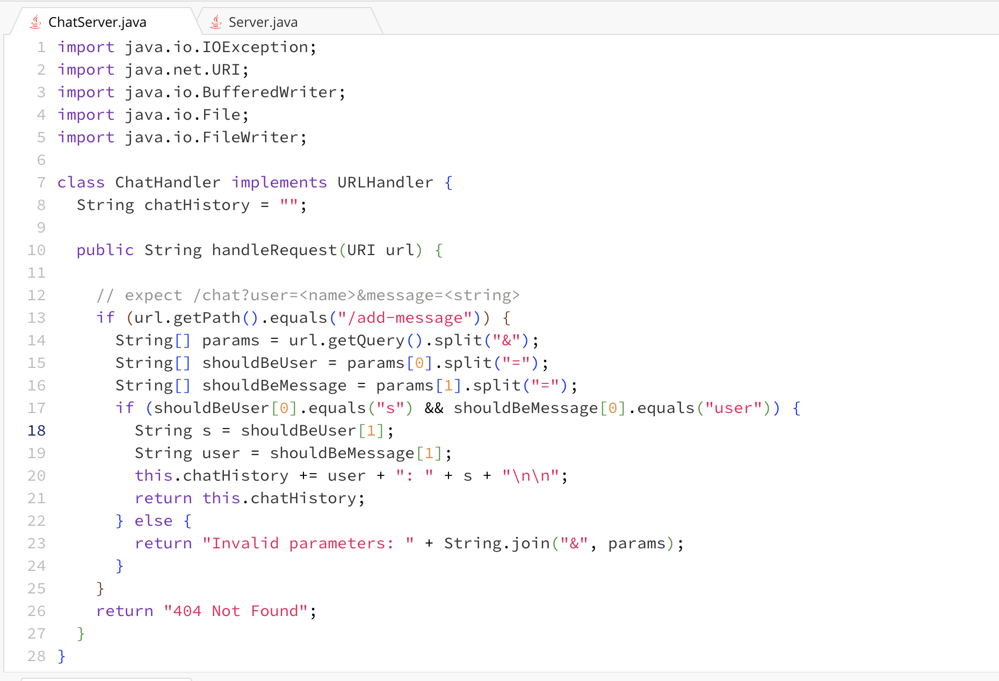

Part 1

Above are my code for the ChatServer and two screenshots of using /add-message.

For the first screenshot
Methods called:
The handleRequest method in the ChatHandler class is called.
Arguments to methods and relevant fields:
Relevant Arguments:
The relevant argument to the handleRequest method is the URL url perameter. 
The chatHistory field of the ChatHandler class is relevant as it stores the chat messages.
Relevant Fields:
chatHistory: Initially empty, it gets updated to include the message "jpolitz: Hello" after processing the request.
Changes to relevant fields:
The chatHistory field is updated to "jpolitz: Hello\n\n" after processing the request.
Explanation: The chatHistory field starts as an empty string. When the /add-message request is received with the parameters "s=Hello" and "user=jpolitz", the handleRequest method concatenates the user and message with a colon and a newline character and appends it to the chatHistory.

For the second screenshot,
Methods called:
The handleRequest method in the ChatHandler class is called.
Arguments to methods and relevant fields:
Relevant Arguments:
The relevant argument to the handleRequest method is the URL url perameter.
The chatHistory field of the ChatHandler class is relevant as it stores the chat messages.
Relevant Fields:
chatHistory: It contains the previous message "jpolitz: Hello\n\n" from the first request.
Changes to relevant fields:
The chatHistory field is updated to "jpolitz: Hello\n\n yash: How+are+you\n\n" after processing the request.
Explanation: The chatHistory field already contained the previous message "jpolitz: Hello\n\n". When the second /add-message request is received with the parameters "s=How+are+you" and "user=yash", the handleRequest method appends the new message "yash: How+are+you" to the existing chatHistory.

Part 2

